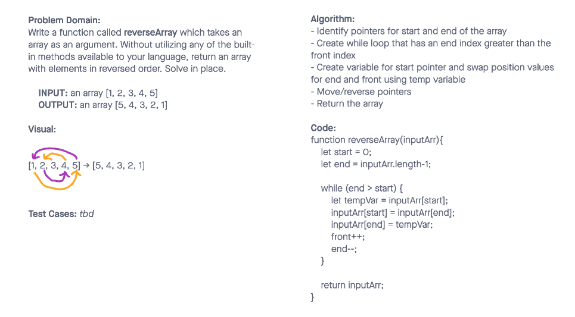

# Reverse an Array

Write a function called reverseArray which takes an array as an argument. Without utilizing any of the built-in methods available to your language, return an array with elements in reversed order.

## Whiteboard Process

Completed with Katharine Swilley

## Approach & Efficiency

Our approach was based on today's demo using the whiteboard technique to discuss the problem domain, visuals, algorithm, and code.
