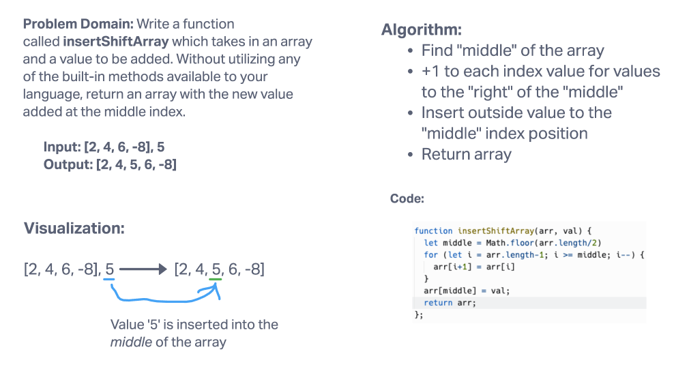
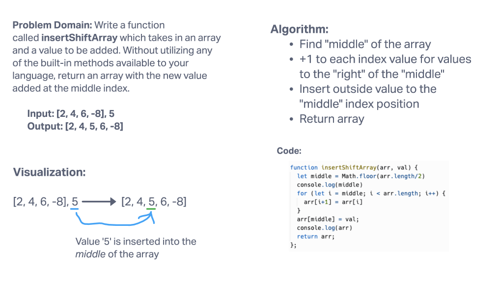

# Array Insert Shift

Write a function called `insertShiftArray` which takes in an array and a value to be added. Without utilizing any of the built-in methods available to your language, return an array with the new value added at the middle index.

## Whiteboard Process

Made further updates to function after 6/15 code review:

Completed with Katharine Swilley for the whiteboard. Also discussed the code challenge with Brady Davenport.

## Approach & Efficiency

Our approach was to identify the middle idx, use a for loop to increase the idx of each position right of the middl idx, and insert the value into the middle idx.
