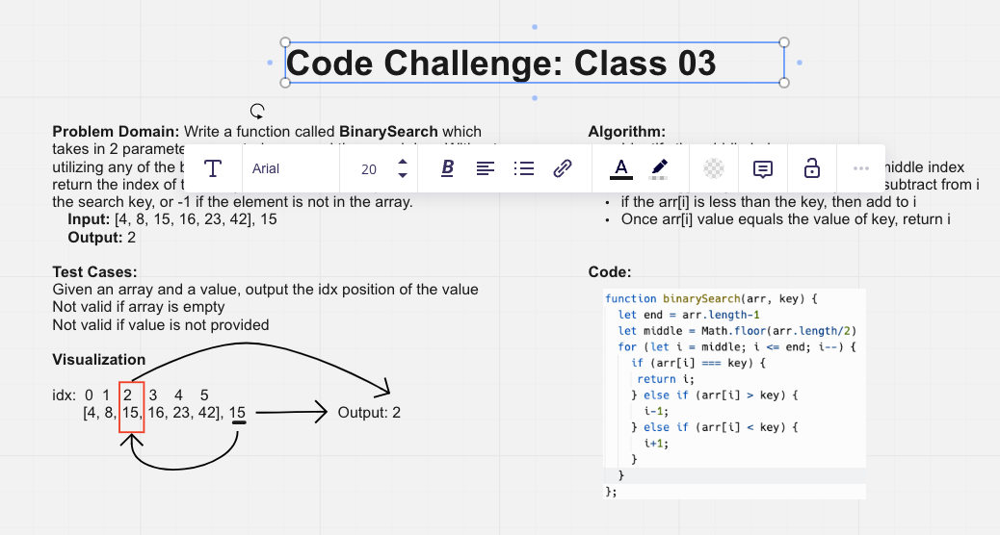

# Array Binary Search

Write a function called BinarySearch which takes in 2 parameters: a sorted array and the search key. Without utilizing any of the built-in methods available to your language, return the index of the array’s element that is equal to the value of the search key, or -1 if the element is not in the array.

## Whiteboard Process

## Approach & Efficiency

I apprached the problem by understanding how binary search works - guessing at the middle and moving up or down based on if it equals the key value. This saves in the # of steps that is required.
