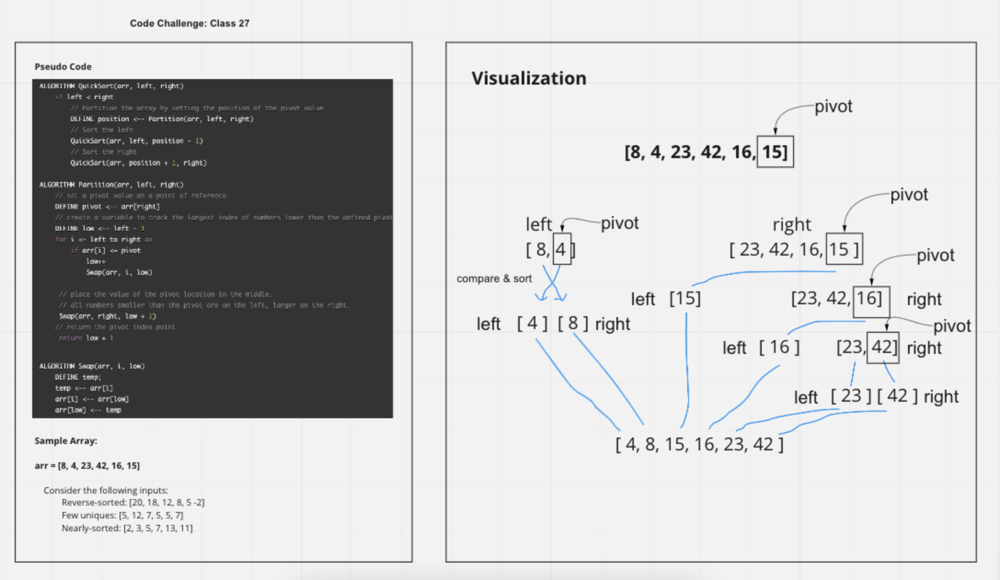

# Blog Notes: Quick Sort

## Merge Sort CC 28

### Author: Elizabeth Hammes

### Problem Domain

Review the pseudocode below, then trace the algorithm by stepping through the process with the provided sample array. Document your explanation by creating a blog article that shows the step-by-step output after each iteration through some sort of visual.

- **Pseudocode**

      ALGORITHM QuickSort(arr, left, right)
        if left < right
          // Partition the array by setting the position of the pivot value
          DEFINE position <-- Partition(arr, left, right)
          // Sort the left
          QuickSort(arr, left, position - 1)
          // Sort the right
          QuickSort(arr, position + 1, right)

      ALGORITHM Partition(arr, left, right)
        // set a pivot value as a point of reference
        DEFINE pivot <-- arr[right]
        // create a variable to track the largest index of numbers lower than the defined pivot
        DEFINE low <-- left - 1
        for i <- left to right do
          if arr[i] <= pivot
            low++
            Swap(arr, i, low)

        // place the value of the pivot location in the middle.
        // all numbers smaller than the pivot are on the left, larger on the right.
        Swap(arr, right, low + 1)
        // return the pivot index point
        return low + 1

      ALGORITHM Swap(arr, i, low)
        DEFINE temp;
        temp <-- arr[i]
        arr[i] <-- arr[low]
        arr[low] <-- temp

- Sample Arrays
  - In your blog article, visually show the output of processing this input array: `[8, 4, 23, 42, 16, 15]`

- For your own understanding, consider also stepping through these inputs:
  - Reverse-sorted: [20,18,12,8,5,-2]
  - Few uniques: [5,12,7,5,5,7]
  - Nearly-sorted: [2,3,5,7,13,11]
- Implementation
  - Provide a visual step through for each of the sample arrays based on the provided pseudo code
  - Convert the pseudo-code into working code in your language
  - Present a complete set of working tests

### CC 28 Post:

The approach I took for quickSort, breaks down into left and right arrays and pushes values from the array into left and right based on comparing each value to the pivot. It then continues to break down into left and right arrays until each value is sorted and then returns the new sorted array.

### Code

[quickSort Function](./index.js)
Referenced the following article [here](https://dev.to/shubhamtiwari909/quicksort-algorithm-in-javascript-5841)

### Testing

[quickSort Tests](./quick.test.js)